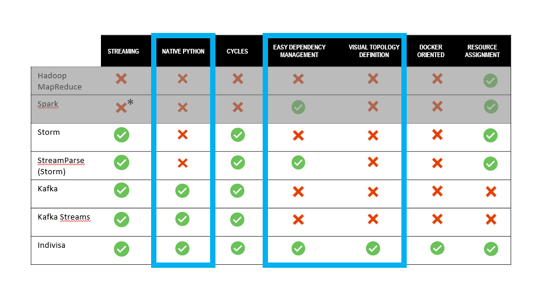
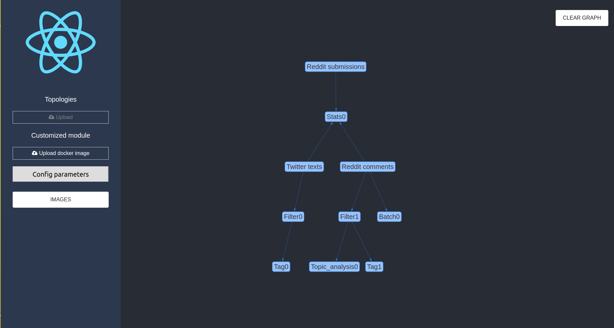
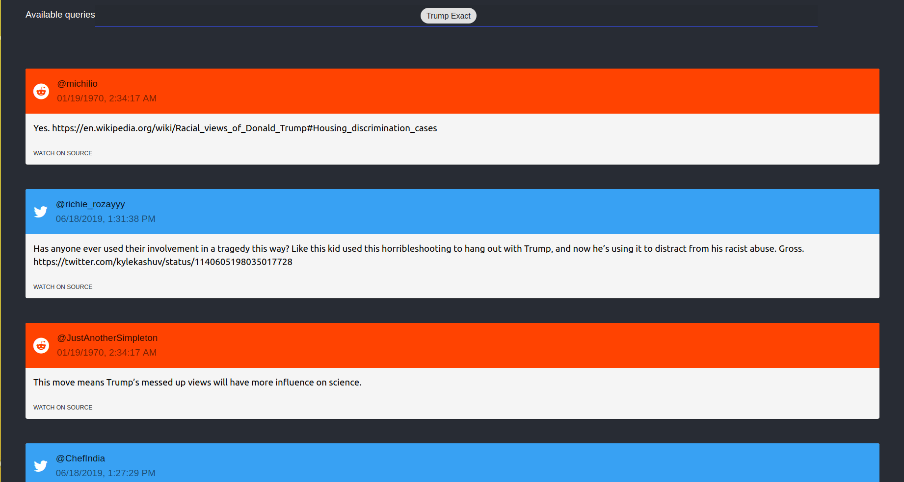
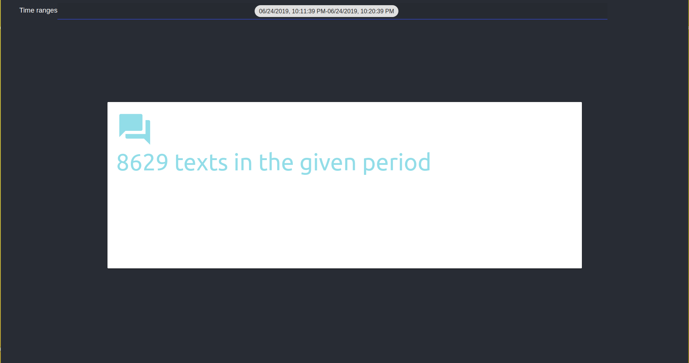
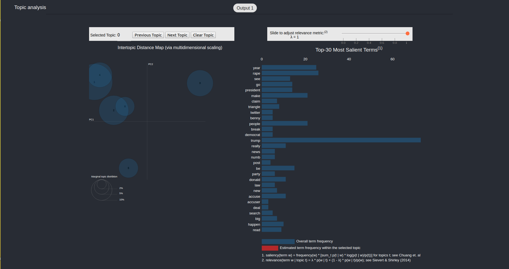
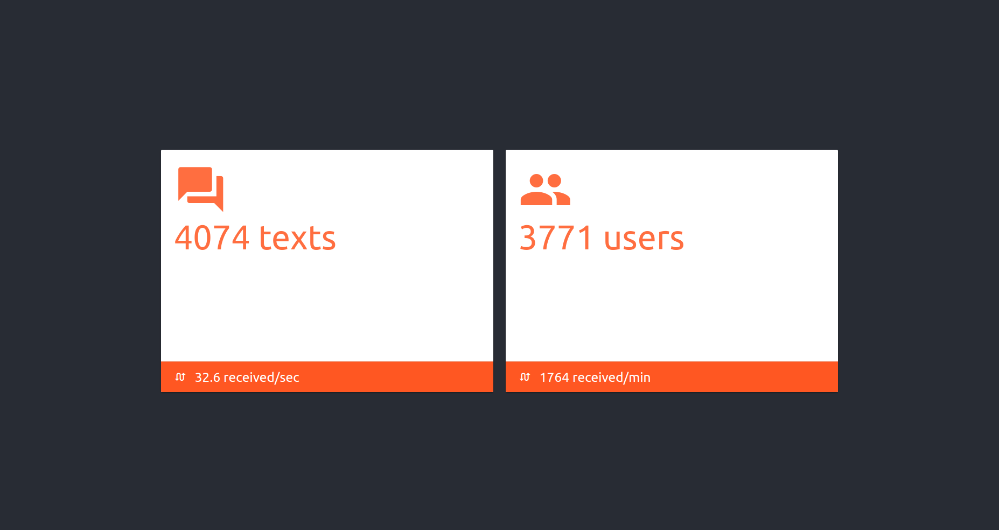

# Indivisa
## Getting started
First of all, you need to have a Docker installation in your computer. Afterwards, you can launch Indivisa executing **launch.sh**. 

## Docs and technology
**Indivisa** is a flexible easy-to-use platform that facilitates the development of **real-time Big Data** applications that analyze **dynamic streams of data**. At the moment, the main use cases that we have developed on the top of Indivisa are oriented to support real-time filtering and topic analysis on Social Media. Indivisa’s design permits the rapid development of effective and efficient solutions for large-scale processing of massive volumes of data. 

The Term “Social Big Data” refers to the content generated by users on social networks. Twitter users, for example, generate more than 481000 tweets per minute. Processing such amount of information is a computational challenge by itself and being able to do it in real-time requires highly effective solutions. One possible use case of Indivisa is to use the platform to support reputation analysis in social networks (e.g., a company filtering and analyzing contents related to its products or to the products of its competitors). Indivisa comes from the Python library Catenae, developed in CiTIUS (Centro Singular de Investigación de Tecnologías Inteligentes de la USC). It has a number of advantages, including modularity, simplicity to scale-up or the possibility of doing RPC calls between modules. Indivisa is composed of some pre-installed modules and the user can upload its own modules (e.g., a new filtering Python module). The pre-installed modules available include: a real-time text filter, a topic analysis module, a dynamic tag cloud generator and a batch processing module, among others.

The main aspects that differentiate Indivisa from other Big Data solutions, such as  Hadoop or Storm, are:

Indivisa combines streaming operations with batch processing, it is written in native Python, it allows cycles in consume topologies and it uses Docker in order to simplify dependency management. A core strength is that Indivisa allows to create consumer topologies in a visual way (i.e., the user can create her own pipeline of processing by simply uploading new Python modules).

Indivisa was developed in CiTIUS by a team of developers and researchers who have expertise on multiple areas, including High Performing Computing, Big Data, Text Mining, Information Retrieval and  Machine Learning. We envisage two main type of users: programmers who might want to personalise the platform to support new Big Data applications or tools and final users who essentially interact with a dashboard that shows the real-time results and analysis made by Indivisa.

For more information, have a look at **indivisa.pdf**

## Video (Demo)

You can have a look at **video.mp4** in order to have an idea about how to work with Indivisa.

## Web Interface

Some user interface images are shown below.

In the main page, users can configure its own toplogy in a visual way.

Real-time filtering is a way to extract texts that are mentioning a given query in social networks. 

In this case, we decided to make a simple example of batch processing: counting texts in a time range. However, the goal was showing Indivisa's other way of working. 

Tag cloud module is a first approach to automatic summarization and it could be improved into a NLG summarization module.

Topic analysis module helps users to identify hidden topics in a dynamic corpus.

Stats module returns platform statistics since it was put into production.

